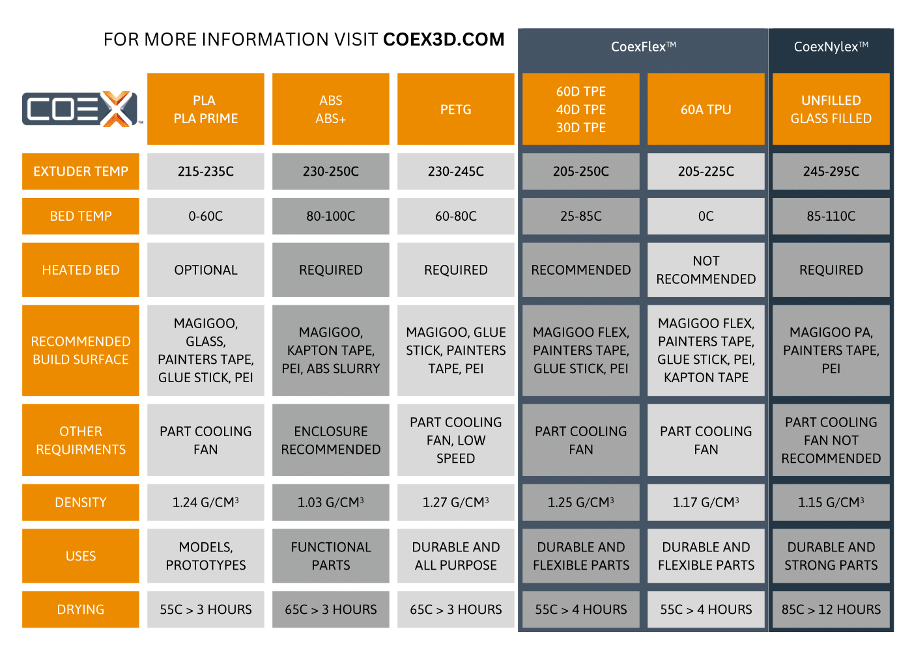
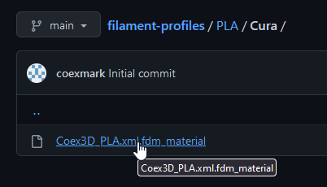
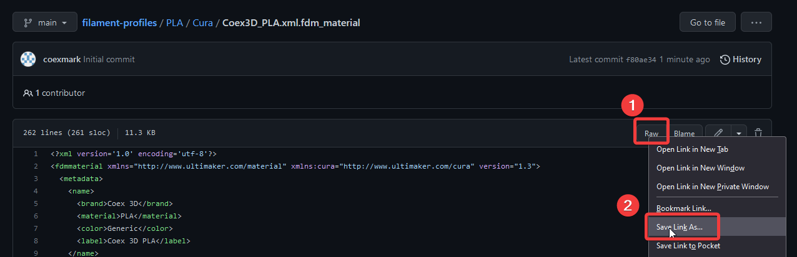
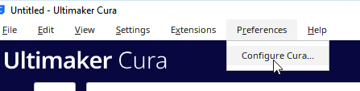
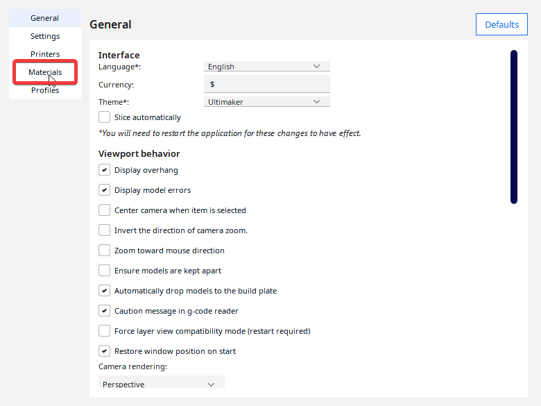
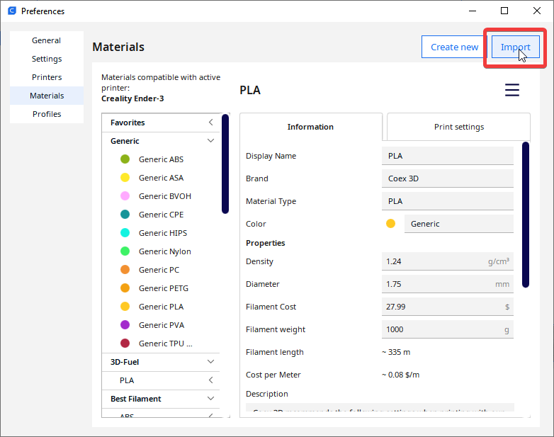
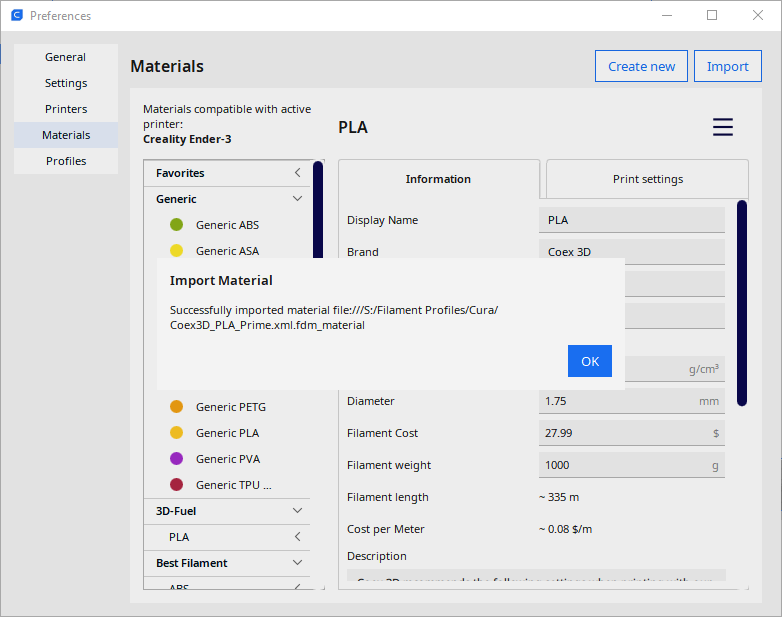
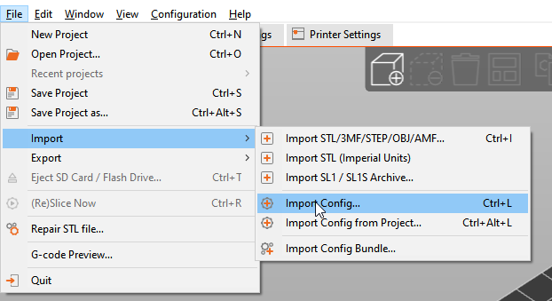

# Coex 3D Filament Profiles

 Slicer filament profiles for Coex 3D filament

Here you can find filament slicer profiles for [Coex 3D](https://coex3d.com) 3D 
printing filaments to help you get up and running quickly with our filament!

**Please Note!** These settings are a starting point and may need further tweaking depending on your printer setup. 

If you have any questions about using our profiles, or have suggestions for settings changes based on what works best for you, feel free to let us know at [support@coex3d.com](mailto:support@coex3d.com)!

# How to use slicer profiles

1. Find the profile for the filament and slicer you're using.  

2. Right click on the "Raw" button and choose "Save Link As" to save the filament profile.  

## Installing in Cura

1. Click "Preferences" and then "Configure Cura..." in the toolbar.  

2. Click "Materials" in the Preferences window.  

3. Click the "Import" button.  
 

4. In the file browser window that appears, browse to the filament profile file you would like to import and click Open. You should get a confirmation saying that the filament profile was successfully imported.  

You can now use the material profile in Cura.

## Installing in PrusaSlicer

1. Click "File", then "Import", then "Import Config..." in the toolbar.  

2. In the file browser window that appears, browse for the filament profile you would like to import and click Open. It will now appear as a filament profile.
3. **Important!** PrusaSlicer will also create Printer and Print Settings profiles related to the imported file. These should be deleted and are not meant to be used.

## Installing in SuperSlicer

Follow the same steps for PrusaSlicer as shown above.
